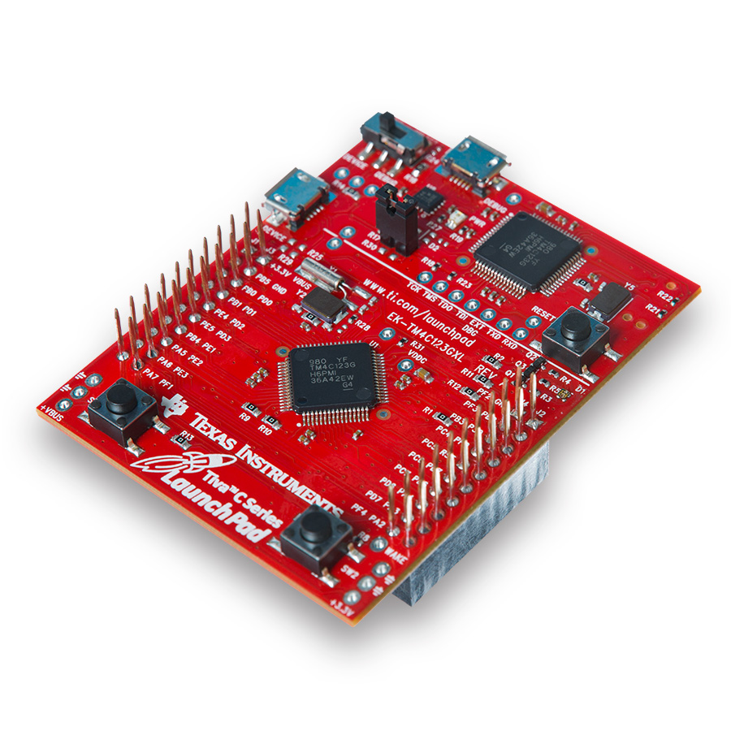

# A Test-Driven Development Environment for the Tiva C Series Launchpad

This is an example project and build environment for the Tiva C Series Launchpad (EK-TM4C123GXL). It demonstrates how to use the Ceedling unit test framework to facilitate test-driven design. Vagrant is used to create the

## Tiva Launchpad

The [Tiva C Series Launchpad (EK-TM4C123GXL)](http://www.ti.com/ww/en/launchpad/launchpads-connected-ek-tm4c123gxl.html) is a low-cost evaluation board from TI for thier powerful line of ARM Cortex-M4F-based microcontrollers. You can get it for [about $13](https://store.ti.com/Tiva-C-LaunchPad.aspx).

Tiva C Series Launchpad (EK-TM4C123GXL):

## Requirements

This build environment requires that [Vagrant](http://www.vagrantup.com/downloads) and [Virtualbox](https://www.virtualbox.org/wiki/Downloads) are installed. Virtualbox 5.0 is supposed to add support for USB 3.0, but I've only been able to get this environment program to the Launchpad board when it's connected to a USB 2.0 port.

## Starting the Enviroment

Launch the environment with: `vagrant up`.

Connect to it with: `vagrant ssh`.

Exit the environment with `exit`.

## Example Project

The example project is in the **example-project** folder. Switch to this folder to run the example project commands.

Execute all unit tests with `rake test:all`.

Run a single test with `rake test:<module>`, e.g. `rake test:led`.

Load the app on the board with: `rake load`.

The load command also builds the application if necessary. Just build the application with: `rake release`.

## Documentation

[Ceedling Manual](https://github.com/ThrowTheSwitch/Ceedling/blob/master/docs/CeedlingPacket.md)

[CMock Manual](https://github.com/ThrowTheSwitch/CMock/blob/master/docs/CMock_Summary.md)

[Unity Manual](https://github.com/ThrowTheSwitch/Unity/raw/master/docs/Unity%20Summary.pdf)
